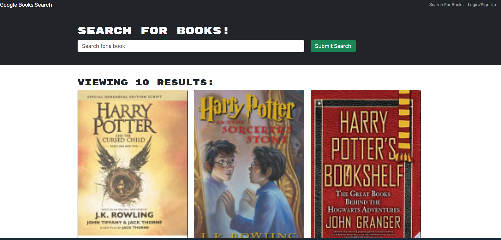

## BookARoo

## Description
The Book Search Engine is a web application that allows users to search for books using the Google Books API, save their favorite books, and view a list of saved books. The application is built using the MERN stack, which includes MongoDB, Express.js, React, and Node.js. The backend uses Apollo Server to implement a GraphQL API, replacing the previous RESTful API.

## Table of Contents
- [Installation](#installation)
- [Usage](#usage)
- [Contributing](#contributing)
- [Tests](#tests)
- [License](#license)
- [Questions](#questions)

## Installation
1. Clone the repository:git clone  <repository-url>2. Navigate to the project directory:cd employee-tracker3. Install dependencies:npm install4. Install Inquirer v8.2.4:npm i inquirer@8.2.45. Set up PostgreSQL database and run the schema.sql and seeds.sql files to populate the database.

## Usage
Start the application:node index.jsFollow the prompts to view, add, or update departments, roles, and employees.

## Contributing
We welcome contributions! Please follow these steps: 1. Fork the repository. 2. Create a new branch: git checkout -b feature-name. 3. Make your changes and commit them. 4. Push the changes: git push origin feature-name. 5. Submit a pull request.

## Tests
"Run the following command to execute tests: npm test. Make sure all tests pass before submitting any changes."

## License
This project is licensed under the MIT License.

## Questions
If you have any questions, feel free to reach out to me:
- GitHub: [slvonderheide](https://github.com/slvonderheide)
- Email: slvonderheide@gmail.com

## Screenshots
